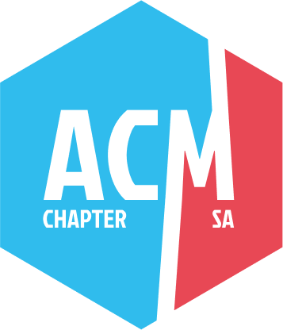

# README
## Advanced Javascript Series Discussion Material for ACM San Antonio 2025
This project is a series of discussions on advanced Javascript topics. The goal is to provide a deeper understanding 
of the language and its features. The series is broken down into three weeks, each week focusing on a different topic.
### Week 1: Array Methods
### Week 2: Objects and Methods used with Objects
### Week 3: Functions and Higher Order Functions

## Additional Information
This project is a work in progress. The README will be updated as the project progresses. 

For More information about ACM SA please visit out website at https://acmsa.org
or if you are interested in joining our developmental communities here in san antonio please connect with us on the 
DevSA discord: https://discord.gg/insert-url-here-gene

  
  

---

## Running the Project
This project is meant to be run in small modular peices for the sake of isolated learning. to run a module check the 
run scripts in the `package.json` file or see list below:

`npm install`
`npm run start:array-methods:name-of-module`

<i>example:</i>

`npm run start:array-methods:forEach`

---

## Copyright
This project is property of The Association for Computing Machinery - San Antonio (ACM SA).
- feel free to use this project for educational purposes
- feel free to fork this repository and make it your own